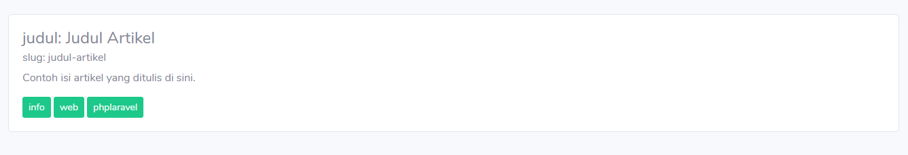

# Quiz 3 

## 0. Setup (5 poin)
Repositori ini dibangun dengan Laravel versi 6.02 ke atas. Setelah melakukan fork dan clone dari repositori ini, lakukanlah langkah-langkah di bawah ini untuk menjalankan project. 

* masuk ke direktori quiz-3
```bash
$ cd quiz-3
```
* jalankan perintah composer install untuk mendownload direktori vendor
```bash
$ composer install
```
* buat file .env lalu isi file tersebut dengan seluruh isi dari file .env.example

* jalankan perintah php artisan key generate
```bash
$ php artisan key:generate
```
* Tambahan: Untuk pengerjaan di laptop/PC masing-masing, sesuaikan nama database, username dan password nya di file .env dengan database kalian. 

Setelah itu kalian sudah bisa lanjut mengerjakan soal berikutnya. jangan lupa untuk menjalankan server laravel
```bash
$ php artisan serve
```
## 1. Membuat ERD (15 poin)
Seorang klien ingin dibuatkan sebuah portal blog seperti [Medium](https://medium.com) yaitu tempat orang berbagi tulisan artikel. Setiap user dapat membuat banyak artikel.
berikut deskripsi singkat mengenai requirement web tersebut: 
* user dapat membuat banyak artikel, 1 artikel kepunyaan satu user (5 poin)
* user dapat mengikuti (*follow*) ke user yang lain.
* 1 user dapat *follow* ke banyak user, dan 1 user dapat diikuti (*follower*) oleh banyak user. (5 poin)
* tabel artikel terdapat data : judul(varchar), isi(varchar), slug(varchar), dan tag(varchar). (5 poin)
* slug adalah string yang otomatis dibuat sesuai judul yang dilowercase dan diberi pemisah (-). contoh judul artikel : "Membuat Tampilan HTML" maka slug nya adalah membuat-tampilan-html
Buatlah ERD untuk keperluan portal blog tersebut lalu export ke dalam format gambar (PNG). Kamu bisa gunakan mysql workbench atau aplikasi online draw.io. 

Simpan file PNG tersebut di dalam folder images dan simpan folder images tersebut di folder public di project  ini.

## 2. Membuat Migrations (10 poin)
Buatlah Migration yang diimplementasi dari ERD yang dibuat di soal sebelumnya. 

## 3. Membuat Model (10 poin)
Buatlah class ArtikelModel untuk merepresentasikan data pada tabel artikel di database. Model tersebut berisi function-function yang dibutuhkan untuk proses CRUD.

## 4. Membuat Controller (10 poin)
Buatlah controller untuk mengatur fitur CRUD artikel. 


## 5. Memasangkan Template & Routing(25 poin)
* Pada project ini kamu diminta untuk memasangkan template dari SB-Admin-2 https://startbootstrap.com/themes/sb-admin-2/. Kami sudah memasangkan asset-asset yang sudah didownload dari halaman SB-Admin-2 di folder public. Tugas kamu adalah memperbaiki template master blade yang terdapat di folder resources/views/layouts/master.blade.php dan hubungkan dengan asset-asset yang diperlukan.  (5 poin)
* Web memiliki route sebagai berikut: (10 poin)

| url                         | method | keterangan      |
|----------                   | -------- | -------------- |
| ```'/'```                   |```GET```| menampilkan gambar PNG/JPG/JPEG desain ERD yang sudah dibuat di soal no. 1  |
| ```'/artikel' ```        | ```GET``` | menampilkan tabel berisi data artikel-artikel |
| ```'/artikel/create'```  | ```GET``` | menampilkan form untuk membuat artikel baru  |
| ```'/artikel'``` | ```POST``` | menyimpan artikel baru 
| ```'/artikel/{id}'``` | ```GET``` | menampilkan halaman detil (show) untuk artikel dengan id tertentu
| ```'/artikel/{id}/edit'``` | ```GET``` | menampilkan halaman form edit untuk artikel dengan id tertentu
| ```'/artikel/{id}'``` | ```PUT``` | menyimpan data dari form edit 
| ```'/artikel/{id}'``` | ```DELETE``` | menghapus data dengan id tertentu

- pasangkanlah script berikut ini ke HANYA ke halaman blade untuk menampilkan data pada tabel artikel (pada url ```'/artikel'```). (10 poin)

```html
<script>
    Swal.fire({
        title: 'Berhasil!',
        text: 'Memasangkan script sweet alert',
        icon: 'success',
        confirmButtonText: 'Cool'
    })
</script>
```
- Jika pemasangan script pada poin sebelumnya berhasil maka akan menampilkan alert seperti ini di halaman courses tersebut:


## 6. Alur CRUD (10 poin)
Pastikan alur CRUD artikel berjalan seperti alur CRUD biasanya. Gambarannya adalah seperti berikut:
* halaman index artikel (```'/artikel'```) menampilkan tabel kumpulan artikel lengkap beserta tombol-tombol actionnya. terdapat pula tombol menuju form pembuatan artikel.
* halaman create artikel menampilkan form untuk membuat artikel baru, sesudah submit lalu halaman kembali ke index artikel.
* halaman show untuk menampilkan detail artikel
* halaman edit untuk menampilkan form edit artikel, sesudah submit kembali ke index artikel 
* dan seterusnya. 

## 7. Tampilan Tag Artikel (15 poin)
Tampilkanlah detil artikel di route ```'/artikel/{id}'``` seperti berikut: 


Catatan: Data yang ditampilkan hanya contoh, sesuaikan data pada tabel artikel sehingga tampilannya seperti gambar contoh. Data tag ditampilkan dengan button-button terpisah.
